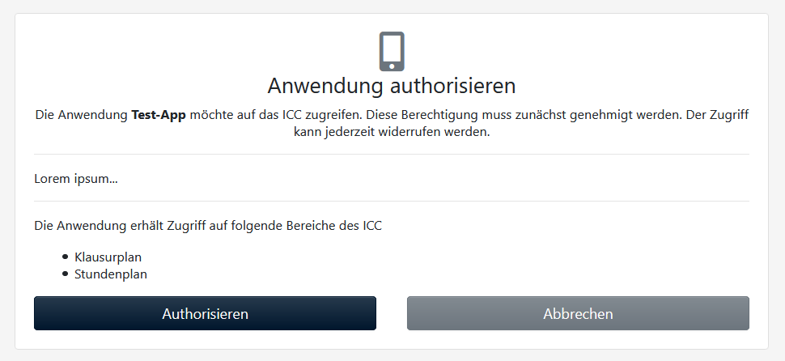

Apps
====

Es ist möglich, Apps an das ICC anzubinden. Dazu stellt das ICC eine API-Schnittstelle bereit.

API-Dokumentation
-----------------

Die API-Dokumentation lässt sich über den Link "API-Dokumentation" im Fußbereich des ICCs abrufen.

Authentifizierung
-----------------

Die Authentifizierung findet über `OAuth 2.0 <https://de.wikipedia.org/wiki/OAuth>`_ statt. Damit eine App überhaupt auf
die API-Schnittstellen zugreifen kann, sind folgende Schritte notwendig:

1. Die App muss im ICC registriert sein
2. Die App verwendet eine OAuth 2.0 Bibliothek, um den Benutzer am ICC zu authentifizieren.
3. Der Benutzer meldet sich über die App an. Nach der Anmeldung muss der Benutzer die App authorisieren:

4. Die App hat nun Zugriff auf die entsprechenden Bereiche.

App-Registrierung
-----------------

Damit die App überhaupt Anmeldungen von Benutzern entgegennehmen darf, muss sie im ICC registriert werden. Dies ist
im Verwaltungs-Menü :fa:`cogs` unter Apps möglich.

Neue App
########

Zunächst müssen Name und Beschreibung eingetragen werden. Diese dienen auch der Anzeige bei der Authorisierung durch
den Benutzer (siehe Screenshot oben).

Anschließend können die OAuth 2.0-spezifischen Einstellungen vorgenommen werden.

* Identifier und Secret werden durch das ICC generiert und lassen sich nicht verändern.
* Grants: Hier wird festgelegt, wie sich Benutzer über die App anmelden.

.. danger:: Auch wenn es hier mehrere Optionen gibt, so wird aktuell nur der "Authorization Code" Grant untersützt.

* Scopes: Hier werden die Bereiche festgelegt, auf die die App zugreifen kann.
* Weiterleitungs-URLs: Hier werden alle Weiterleitungs-URLs festgelegt, die diese App besitzt. Nach erfolgreicher Anmeldung
wird zu einer dieser Adressen (sie wird bei der Anfrage mitgeschickt und überprüft, ob sie zur App passt) weitergeleitet.

Client-Einstellungen
--------------------

Die App muss nun die OAuth 2.0 Bibliothek folgendermaßen konfigurieren:

* Grant type: Authorization Code
* Client ID: Der Identifier (in den App-Details zu finden)
* Client Secret: in den App-Details zu finden
* Scopes: die verwendeten Scopes (s.u.)
* Request Method: POST
* Authoritation endpoint: https://icc.example.com/oauth2/authorize
* Token endpoint: https://icc.example.com/oauth2/token
* Redirect endpoint: wird selbstständig gewählt - wurde im ICC festgelegt (s.o.)

Scopes
######

Aktuell sind folgende Scopes möglich:

+---------------+---------------+
| Scope         | Beschreibung  |
+===============+===============+
| exams         | Klausurplan   |
+---------------+---------------+
| messages      | Mitteilungen  |
+---------------+---------------+
| substitutions | substitutions |
+---------------+---------------+
| timetable     | Stundenplan   |
+---------------+---------------+
| appointments  | Termine       |
+---------------+---------------+
