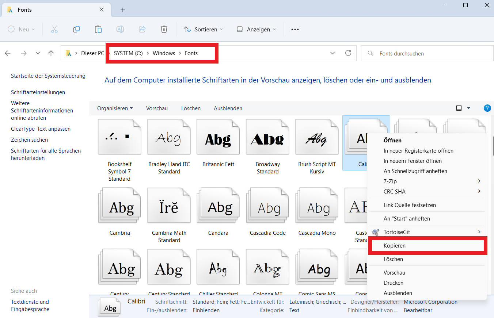

Unterrichtsbuch
###############

Mithilfe des Unterichtbuches kann Unterricht dokumentiert werden. Es entspricht dem digitalen Klassenbuch bzw. der
digitalen Kursmappe.

Export
--------------

Unterrichtsbücher können als JSON, XML oder PDF exportiert werden. Damit der PDF-Export einwandfrei funktioniert, muss
jedoch eine Schriftart hochgeladen werden (die Standard-PDF-Schriftart kann leider nur ASCII und das bereitet bei
Sonderzeichen Schwierigkeiten).

Aufgrund von Lizenzgründen (und aus Gründen der Flexibilität) wird keine Schriftart mitgeliefert. Stattdessen muss diese
in den Einstellungen (Reiter "Unterrichtsbuch") hochgeladen werden. Die Schriftart muss als TTF vorliegen. Man kann diese
entweder von Google Fonts beziehen oder aber man importiert eine Windows Schriftart.

Wenn man z.B. die Schriftart Calibri verwenden möchte, geht man folgendermaßen vor. Auf einem Windows PC öffnet man im
Windows Exporer den Pfad `C:\Windows\Fonts`. Anschließend die gewünschte Schriftart (bspw. Calibri) auswählen und kopieren
(über das Kontextmenü oder Strg+C):

Anschließend fügt man die Dateien in einen beliebigen Ordner ein und man erhält einen Haufen von TTF-Dateien. Darin muss
nun die Standard-Schriftbreite und die Schriftbreite "fett" gefunden werden (`calibri.ttf` bzw. `calibrib.ttf`). Diese
müssen nun hinterlegt werden:

.. image:: ../images/import-calibri.png