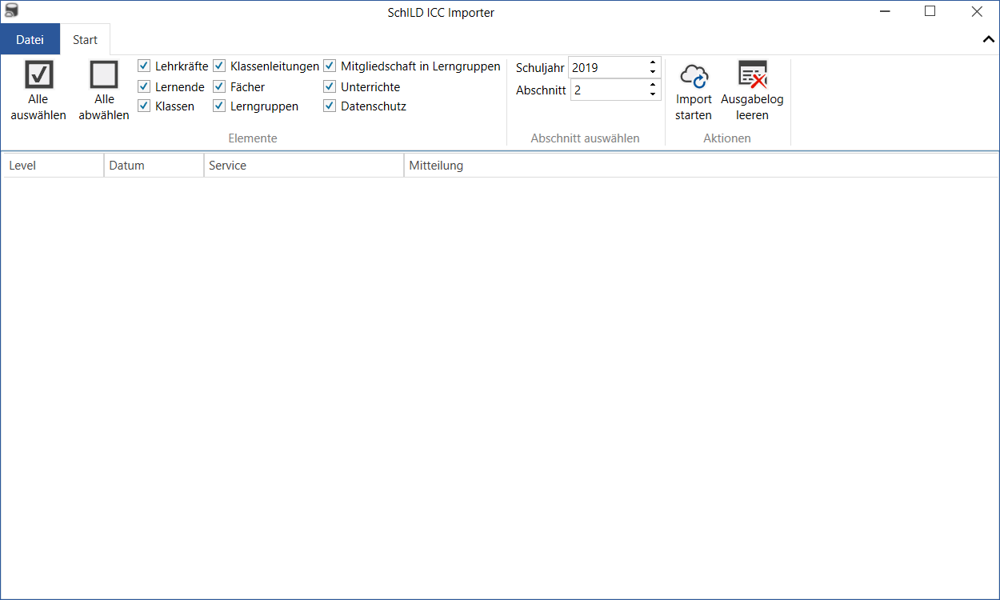

SchILD NRW
==========

Der Import aus SchILD NRW erfolgt mithilfe des `SchILD ICC Importer <https://github.com/schulit/schild-icc-importer>`_.

Installation und Konfiguration
------------------------------

Hinweise zur Konfiguration und Installation des Programmes gibt es auf `GitHub <https://github.com/schulit/schild-icc-importer>`_.

Importvorgang
-------------

Dazu die gewünschten Optionen und das aktuelle Schuljahr auswählen und auf "Import starten" klicken.

.. warning:: Aktuell unterstützt das ICC keine Schuljahresabschnitte. Es kann immer nur der aktuelle Abschnitt hochgeladen werden.